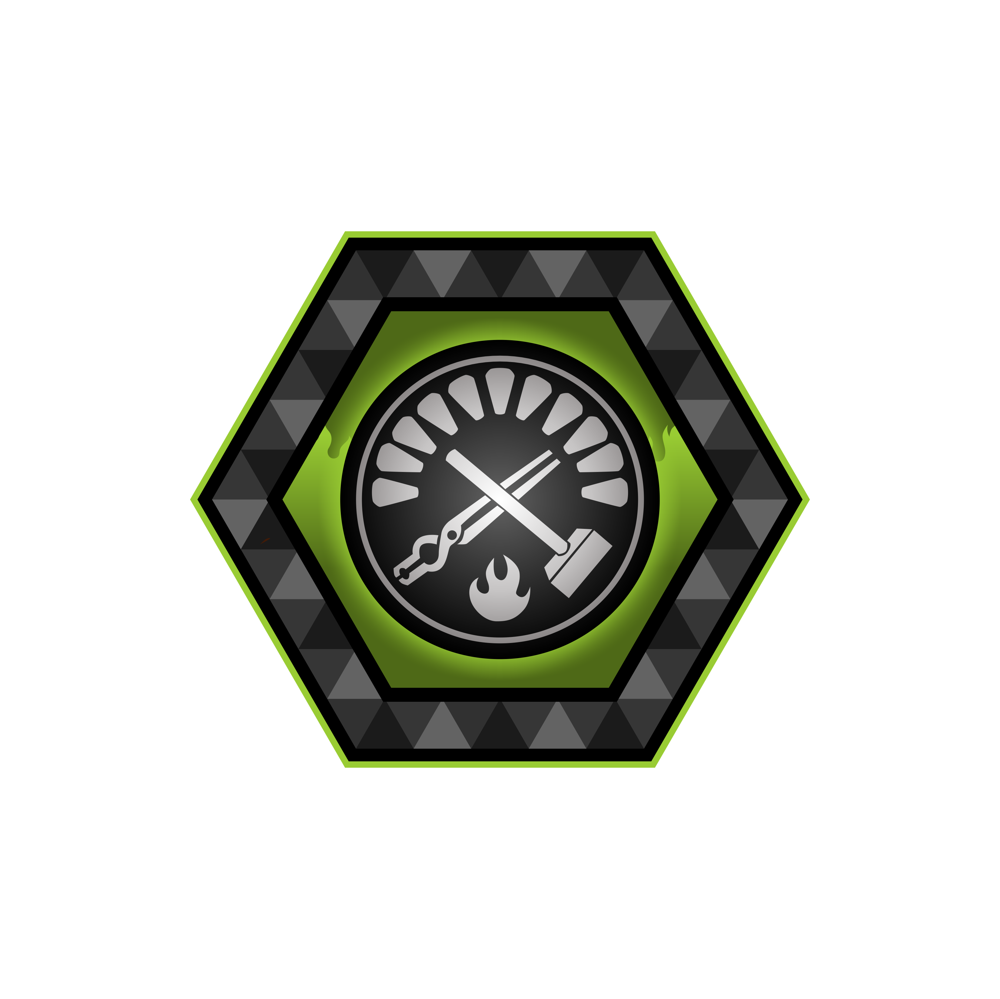

<a name="readme-top"></a>

<!-- PROJECT LOGO -->
<br />
<div align="center">
  <a href="https://github.com/asobiesk/hardhat-fund-me-fcc">
    
  </a>

<h3 align="center">Foundry Smart Contract Lottery</h3>

  <p align="center">
    dApp created with Solidity with Foundry toolkit. It implements a verifiable, transparent and just raffle on the EVM blockchain. Users can enter the raffle paying the entrance fee. Once every hour the winner will be automatically selected and receive the whole balance of the contract. Randomness is provided by Chainlink VRF and automation is achieved using Chainlink Automation.
    <br> 
    Created as a part of <a href="https://youtu.be/umepbfKp5rI">this amazing course</a>!
  </p>
</div>

# Built With

- [![Solidity][Solidity]][Solidity-url]
- [![Ethereum][Ethereum]][Ethereum-url]
- [![Foundry][Foundry]][Foundry-url]
- [![Chainlink][Chainlink]][Chainlink-url]

<p align="right">(<a href="#readme-top">back to top</a>)</p>

# Getting Started

## Requirements

- [git](https://git-scm.com/book/en/v2/Getting-Started-Installing-Git)
  - You'll know you did it right if you can run `git --version` and you see a response like `git version x.x.x`
- [foundry](https://getfoundry.sh/)
  - You'll know you did it right if you can run `forge --version` and you see a response like `forge 0.2.0 (816e00b 2023-03-16T00:05:26.396218Z)`

## Quickstart

```
git clone https://github.com/Cyfrin/foundry-smart-contract-lottery-f23
cd foundry-smart-contract-lottery-f23
forge build
```

### Optional Gitpod

If you can't or don't want to run and install locally, you can work with this repo in Gitpod. If you do this, you can skip the `clone this repo` part.

[](https://gitpod.io/#github.com/ChainAccelOrg/foundry-smart-contract-lottery-f23)

<p align="right">(<a href="#readme-top">back to top</a>)</p>

# Usage

## Start a local node

```
make anvil
```

## Library

If you're having a hard time installing the chainlink library, you can optionally run this command.

```
forge install smartcontractkit/chainlink-brownie-contracts@0.6.1 --no-commit
```

## Deploy

This will default to your local node. You need to have it running in another terminal in order for it to deploy.

```
make deploy
```

## Deploy - Other Network

[See below](#deployment-to-a-testnet-or-mainnet)

## Testing

We talk about 4 test tiers in the video.

1. Unit
2. Integration
3. Forked
4. Staging

This repo we cover #1 and #3.

```
forge test
```

or

```
forge test --fork-url $SEPOLIA_RPC_URL
```

### Test Coverage

```
forge coverage
```

<p align="right">(<a href="#readme-top">back to top</a>)</p>

# Deployment to a testnet or mainnet

1. Setup environment variables

You'll want to set your `SEPOLIA_RPC_URL` and `PRIVATE_KEY` as environment variables. You can add them to a `.env` file, similar to what you see in `.env.example`.

- `PRIVATE_KEY`: The private key of your account (like from [metamask](https://metamask.io/)). **NOTE:** FOR DEVELOPMENT, PLEASE USE A KEY THAT DOESN'T HAVE ANY REAL FUNDS ASSOCIATED WITH IT.
  - You can [learn how to export it here](https://metamask.zendesk.com/hc/en-us/articles/360015289632-How-to-Export-an-Account-Private-Key).
- `SEPOLIA_RPC_URL`: This is url of the goerli testnet node you're working with. You can get setup with one for free from [Alchemy](https://alchemy.com/?a=673c802981)

Optionally, add your `ETHERSCAN_API_KEY` if you want to verify your contract on [Etherscan](https://etherscan.io/).

1. Get testnet ETH

Head over to [faucets.chain.link](https://faucets.chain.link/) and get some tesnet ETH. You should see the ETH show up in your metamask.

2. Deploy

```
make deploy ARGS="--network sepolia"
```

This will setup a ChainlinkVRF Subscription for you. If you already have one, update it in the `scripts/HelperConfig.s.sol` file. It will also automatically add your contract as a consumer.

3. Register a Chainlink Automation Upkeep

[You can follow the documentation if you get lost.](https://docs.chain.link/chainlink-automation/compatible-contracts)

Go to [automation.chain.link](https://automation.chain.link/new) and register a new upkeep. Choose `Custom logic` as your trigger mechanism for automation.

## Scripts

After deploy to a testnet or local net, you can run the scripts.

Using cast deployed locally example:

```
cast send <RAFFLE_CONTRACT_ADDRESS> "enterRaffle()" --value 0.1ether --private-key <PRIVATE_KEY> --rpc-url $SEPOLIA_RPC_URL
```

or, to create a ChainlinkVRF Subscription:

```
make createSubscription ARGS="--network sepolia"
```

## Estimate gas

You can estimate how much gas things cost by running:

```
forge snapshot
```

And you'll see and output file called `.gas-snapshot`

<p align="right">(<a href="#readme-top">back to top</a>)</p>

# Formatting

To run code formatting:

```
forge fmt
```

<p align="right">(<a href="#readme-top">back to top</a>)</p>

# Acknowledgments

Thank you Patrick Collins!

<!-- MARKDOWN LINKS & IMAGES -->
<!-- https://www.markdownguide.org/basic-syntax/#reference-style-links -->

[Ethereum]: https://img.shields.io/badge/Ethereum-3C3C3D?style=for-the-badge&logo=Ethereum&logoColor=white
[Ethereum-url]: https://ethereum.org
[Solidity]: https://img.shields.io/badge/Solidity-e6e6e6?style=for-the-badge&logo=solidity&logoColor=black
[Solidity-url]: https://docs.soliditylang.org/en/v0.8.17/
[Foundry]: https://img.shields.io/badge/Foundry-e28743?style=for-the-badge&logo=data%3Aimage%2Fpng%3Bbase64%2CiVBORw0KGgoAAAANSUhEUgAAAFEAAABTCAAAAADCLLThAAAFyUlEQVRYw%2B2ZW4hVVRjHf0fLy3iB8gamRy3TMZOSoSDxgtrNhEjLKZUgUcawjCCNUhCK1LC0IKzGzKJSKQ19SM168E6TTVEmalY6Sul4aSQ5jhcc%2Fz2stfdZa1%2FOOUoPBa6Xs%2Fde3%2F6tb6%2B1vsv6Tkb8y60Z%2F3vipZqM0zY1lYJUoVYXld6loi1VRw3PZO74JSp%2BdmQm0%2B%2Fileg4BTqGNy18wd4wuoCOyUSolCRdkKScM3STJGlyockikbczuADp45DYA1gnSdqXzox3XIQZIQ9iF80kSQvhbInEiwyQA4wT4bAkaXAKMkr8jdXyiLPjxC1GoIatJRDnMU2S6NPkKDnG%2Fo43D%2Bql0UjSm0wqSnyaFZI0CJBaGUCNDlqiuS%2BTpgI5SdsZVoQI2xKXBKCL3gWgWhoLwM%2FGpgoSN7NJCnW7LU8cByw43dLe2f3JN5L2FSQOMNcVjjVVATwoARoYWR%2BrHp3SifSVJB0PXjgRvC3BM8GlDgT9Q%2BxMpRJnTpM0BvJadpO0DY6a%2FoMP0Msd0GguvXFPCnF2%2BEFb3N2dYKIANDnCQ5OJXCtlA9DZsiLExdL1gXA7EokvIe1wpvw4oVeIE2cafwfAHokRSUR2OouIJK1M1jHDnZK0NBBtKx33BDOGk0FAJhA7U1YsmISiCt%2BORK5KAL1m79oUA75qfzudB5iVEBWQRGdJuW4lBDRNNELLJHXgnG955vrUHDOLEyWNKIE4PJD5AWCzPtkTJSKttZ7lsKSprRKtQZI0nRclLelTK%2Bnx%2FGZPIN4QTMMB29MRrokDm5xxnJnjgk8chrt1bJjvBXAwthvrlKO9xwOJ1h6xDp%2FIsrwK1S6vEbpIkPWBHHFnyFjzHF8ijDm%2BlnUg9YQmKbRYK7%2BSBp%2BYtqad817LeJqa%2BEQo4tQKE3%2FNq7wbWktlAb84cT8APatORSS3GGYOJDWHjX537Rw7ZIVP7Ct1C%2BakMsl7nbvJxoOs27V3tn1np3SfT5znLUyFj9xmv3xU1JK8pfkQL3%2Fs4Fl6JJEdPBBgDxtgebrr6O3tFKqjvtFpDfBZFmAGuUhXV%2BedWtJy3MojkQf9obIG4JGtUR%2F35%2FNpOS7VkiavSdoU9xuJJbUFHNLN%2FC5966%2FM6%2BkJK6yRGnmhkIv7UtJHPvHWdF6ZyUqy2lXYbT7kE5slS%2F1kQl053Fhn125rGrGiBCv8AnjbgJaaJ9kCWkat8GRcZBywSsc8CADPJRMX%2BsT5yZH%2BL0W0uhFgvyRpE9nJ%2BQPU2rxSSNoV%2B5ba5RXM1SwBu72OxQCcle4FTjuf6nvcIHMMcGaj9mvo9Ud83uqctLe5ScrlLy6xTBeAYUDZ2vBY4LQlAEyx2UQY788XJAYe%2B3T1kYQ1OGiNrc5NTGPRtX6B8%2BTJMAaktBbwGM9a4CZJWr8jlpu5Y1Qb4nWpxMb%2Bq0ffUuW6qubxbI%2FJeTsZaYjH%2FM30fXi5BqBt8O2StIgEov3NWcffx%2F3oC1VSub%2FPx1jg%2B%2FHsPsxI99mTdCstCxLtUKaTdIR3HOBOC8xZNZoSiOON8awYZEP76ejqw8uSpA0ANvy3Mv1l5cmZfRuTULeE6Qle4IP81iNrE9eHzYMeyZm9GpGk9jnKfNynhgjYXfz3%2FKwfkTiUckIa%2B4oxWx9Y7YRR%2B2iCvZ1rl%2F729FPc0PjWq3UOgiODh%2B2CY3aRU5y6JFhJlUOsl2zCMdj9ZtIrSPXvZfYmHDOmVZqLHl3Yam162xqGmXGOZqRCFSRrAk5b54pOyAfNQ6FBFKkqDGF78sEyOd%2Boo3vRysek0DRse8oF3u33fcVdJVRnNvJdupLRQs7ikipIOUZ5906%2B3d7reILjJVa5coFHCVovw3srGs3rL6cS54%2B%2Bvjt0%2Fjw67OVWC2cVOhYuutxqoWzFpGtSRznwo3T5RJ3pDI%2FGYuGpqdDihK6IKEn6Omphqy4VrQwXOUg3VLu8hSeLl5qDOsXVfwGuEv8TxH8AeG4ga5mp%2FlIAAAAASUVORK5CYII%3D
[Foundry-url]: https://getfoundry.sh/
[Chainlink]: https://img.shields.io/badge/Chainlink-2596be?style=for-the-badge&logo=Chainlink&logoColor=white
[Chainlink-url]: https://chain.link/
